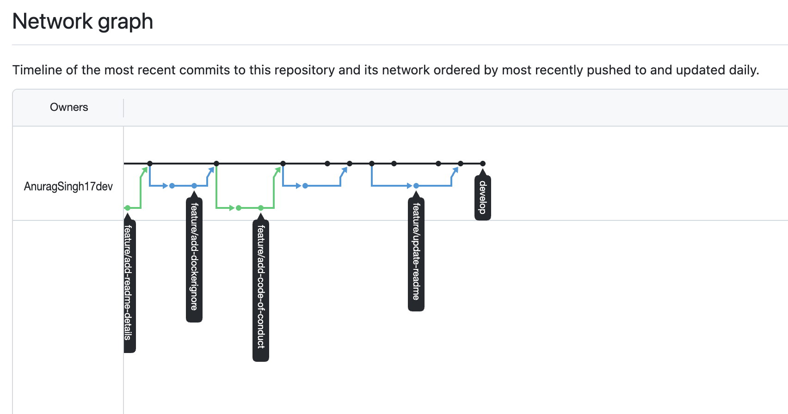
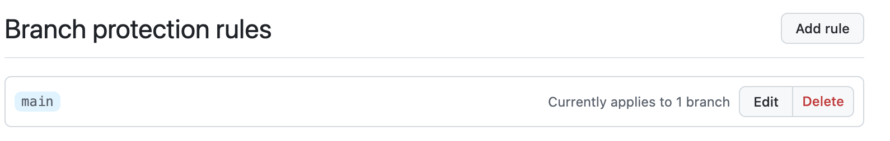
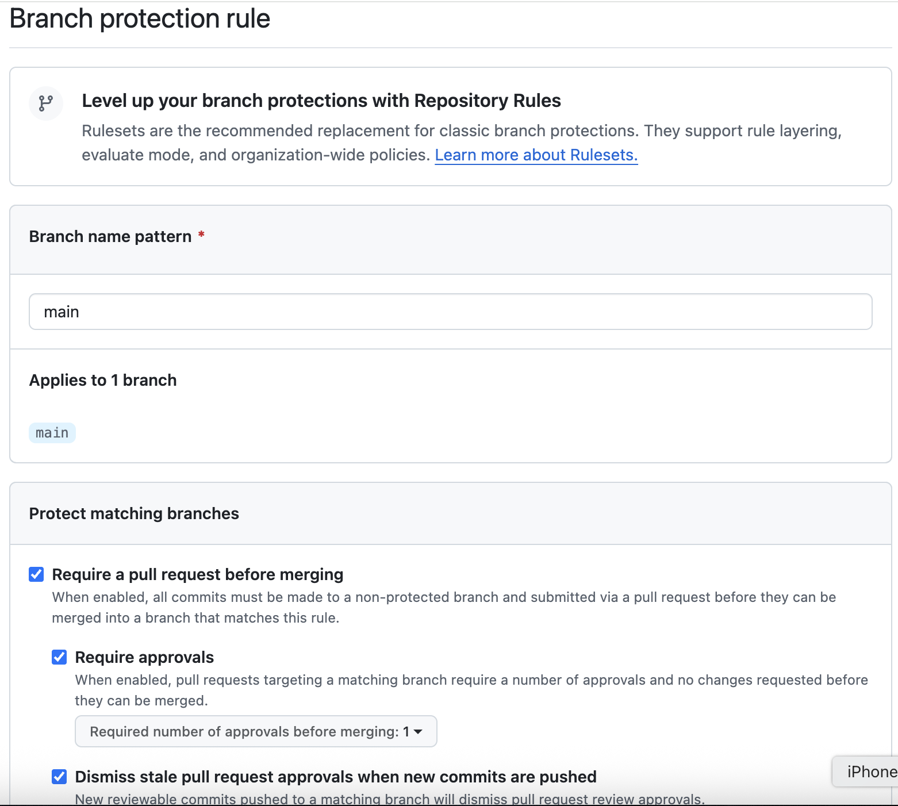

# MAI201 MLOps: Assignment 1 Report

## 1. GitHub Network Graph

## 2. Branch Protection Rules

## 3. Git Log (--oneline --graph)
Captured via GitHub Insights → Network graph (see screenshot above).
Commit history summary:
- feature/add-readme-details: 2 commits, merged into develop
- feature/add-dockerignore: 2 commits, merged into develop
- feature/add-code-of-conduct: 2 commits, merged into develop
- feature/update-readme: conflict resolved and merged into develop

## 4. Reflection on Merge Conflicts
I found it challenging to identify which changes to keep when both branches
edited the same file. I learned that carefully reading the conflict markers is essential
to preserving all intended changes.

